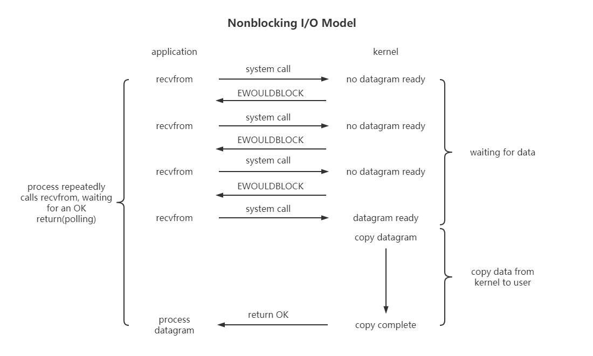
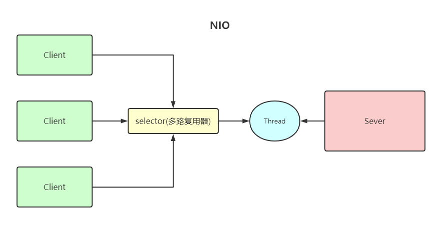
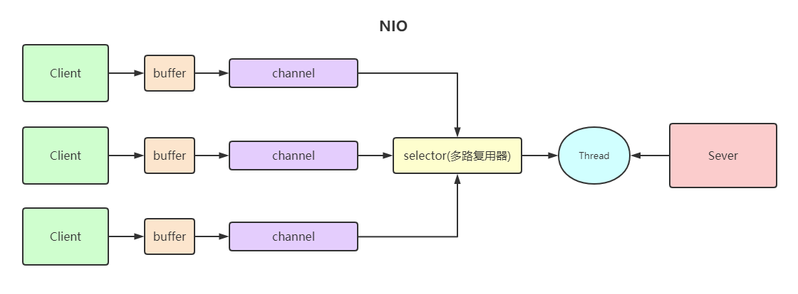
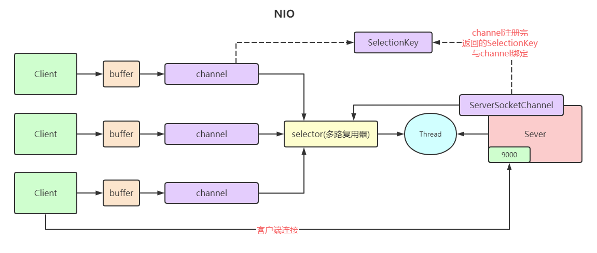

# IO & Netty
## 一、IO & IO模型
IO，无非涉及两个参与方，一个输入，一个输出。然而根据参与双方的设备类型，大体分为磁盘I/O和网络I/O。
不论何种IO类型，均为数据交互操作。
在讲述IO模型之前，同步(synchronous)IO、异步(asynchronous)IO、阻塞(blocking)IO和非阻塞(non-blocking)IO分别是什么，到底有什么区别？

== *首先从Linux背景环境下的network IO说起* ==
**参考文献：W．Richard Stevens著 "UNIX® Network Programming Volume 1, Third Edition: The Sockets Networking"，6.2 I/O Models**

在6.2章节中比较了5种IO Model：
- Blocking I/O Model
- Nonblocking I/O Model
- I/O Multiplexing Model
- Signal-Driven I/O Model
- Asynchronous I/O Model

由于Signal-Driven I/O Model在实际中并不常用，故只提及其余四种IO Model。

***说明：IO发生时涉及的对象和步骤***
对于一个network IO（以read举例），它涉及到两个系统对象，一个是调用这个IO的process(or thread)，另一个是系统内核(kernel)。当一个read操作发生，它会经历两个阶段：
1. 等待数据准备（waiting for the data to be ready）
2. 将数据从内核拷贝到进程中（copying data from the kernel to the process）

**这两点很重要，各IO Model的区别就在于这两个阶段有不同的情况**

### - Blocking I/O Model
在linux中，默认情况下所有的socket都是blocking的，一个典型的读操作流程如下图：

当用户进程调用了recvfrom这个系统调用，kernel就开始了IO第一个阶段：数据准备。对network IO来说，很多时候数据在一开始还没有到达（比如还没有收到一个完整的UDP包），这个时候kernel需要等待足够的数据到来。
此时在用户进程这边，整个进程会被阻塞。当kernel等到数据准备好了，它便会将数据从kernel中拷贝到用户内存，拷贝完成后kernel返回OK结果，用户进程才解除block状态重新运行起来。
所以，对于Blocking I/O Model的特点就是**在IO执行的两个阶段都被block了**。

### - Nonblocking I/O Model
linux下，可以通过设置socket使其变为non-blocking。当对一个non-blocking socket执行读操作时，流程如下：

从图中可以看出，当用户进程发出read操作时，如果kernel中的数据还没准备好，那么它并不会block用户进程，而是立刻返回一个error。从用户进程的角度来说，它发起一次read操作后并不需要等待，而是马上得到了一个结果。
用户进程判断结果是error时，它就知道数据还没有准备好，于是它可以再次发送read操作。一旦kernel中的数据准备好了，并且再次收到用户进程的system call，那么它马上就将数据拷贝到用户内存然后返回OK结果。
所以，对于Nonblocking I/O Model来说，用户进程需要不断主动询问kernel数据准备好了没有，也就是**在kernel准备数据的这段期间，用户进程是活动的，非阻塞的，它不断轮询调用recvfrom等待返回成功结果**。
此时我们应注意到，当kernel数据准备好并收到用户进程的system call时，在kernel拷贝数据到用户内存的这段时间里，用户进程是阻塞的，因为没有立刻收到kernel的返回结果。直到kernel数据拷贝完毕并返回OK，用户进程解除block重新运行。

### - I/O Multiplexing Model
IO多路复用。这个词可能比较陌生，常听闻Netty的NIO模型等等。首先说说Linux API提供的I/O复用方式：select、poll和epoll。
||select|poll|epoll|
|:-:|:-:|:-:|:-:|
|操作方式|遍历|遍历|回调|
|底层实现|数组|数组|哈希表|
|IO效率|每次调用都进行线性遍历，时间复杂度O(n)|每次调用都进行线性遍历，时间复杂度O(n)|事件通知方式，每当有IO事件就绪，系统注册的回调函数就会被调用，时间复杂度O(1)|
|最大连接|有上限|无上限|无上限|

这种IO方式也被称为event driven IO。它们的好处在于单个process就可以同时处理多个网络连接的IO，基本原理就是select/poll/epoll这个function会不断轮询所负责的所有socket，当某个socket有数据到达了就通知用户进程。流程如图：

当用户进程调用了select，那么整个进程会被block，同时kernel会"监视"select负责的所有socket，当任何一个socket中的数据准备好了，select就会返回。这个时候用户进程再调用read操作，等待kernel将数据拷贝到用户进程。
在I/O Multiplexing Model中，实际对于每一个socket，一般都设置成non-blocking。但如上图所示，可以发现整个用户的process其实一直被block。需要注意的是**process是被select这个函数block了，而不是被socket IO给block的**。

### - Asynchronous I/O Model
异步IO。首先看一下它的流程：

用户进程发起read操作后，立刻就可以开始去做其他事情了。
另一方面，从kernel的角度，当它收到一个asynchronous read之后，首先它立刻返回，所以不会对用户进程产生任何block。
之后kernel会等待数据准备完成，然后将数据拷贝到用户内存，当这一切都完成后，kernel会给用户进程发送一个signal，告诉它read操作完成。
**对于Asynchronous I/O Model，用户进程在kernel等待数据和拷贝数据两个阶段都没有被block**。

### - Comparison of the I/O Models
上述4种I/O Model均介绍完毕，再**回顾最初的问题**：阻塞(blocking)和非阻塞(non-blocking)，同步(synchronous)和异步(asynchronous)的区别
- *blocking vs non-blocking*
前面其实已经很明确的说明了这两者的区别。Blocking I/O会一直block住对应的用户进程直到操作完成，而Nonblocking I/O在kernel准备数据期间，用户进程是活动的，不断轮询调用recvfrom等待返回成功结果。**有趣的是在kernel拷贝数据阶段它们的用户进程均被block**。
- *synchronous vs asynchronous*
在说明synchronous和asynchronous区别之前，需要先给出双方的定义。参考W．Richard Stevens给出的定义：
***A synchronous I/O operation causes the requesting process to be blocked until that I/O operation completes;***
***An asynchronous I/O operation does not cause the requesting process to be blocked;***
也就是：
同步I/O操作导致请求进程被阻塞，直到该I/O操作完成；
异步I/O操作不会导致请求进程被阻塞；
两者的区别在于**synchronous I/O做I/O operation时会导致process阻塞，而asynchronous I/O不会**。那么按照W．Richard Stevens的定义，前边讲述的**Blocking I/O、Nonblocking I/O、I/O Multiplexing都属于synchronous I/O**。
对于asynchronous I/O，当进程发起IO操作之后，就直接收到返回再也不理睬了，该干嘛干嘛直到kernel发送一个信号告知进程IO操作完成。**整个过程中，进程完全没有被block**。
---
综上，对各个I/O Model的比较如图所示：

至此，经过上面的介绍，我们会发现non-blocking IO和asynchronous IO的区别还是较为明显的。在non-blocking IO中，虽然进程大部分时间都不会被block，但需要进程主动check，且当数据准备完毕后，也需要进程主动调用recvfrom并等待kernel将数据拷贝至用户内存完成。
而asynchronous IO则完全不同，它就像是用户进程完全将IO操作任务交给了他人（kernel）完成，他人完成后发信号通知就行。用户进程不需要去检查IO操作的状态，也不需要等待kernel拷贝数据。

## 二、Java中的网络IO模型
== *以下主要讲述Java中的网络IO模型* ==

**Java共支持3种网络编程IO模式：BIO、NIO、AIO**
### - 同步、异步、阻塞和非阻塞
[见IO & IO模型](#一、IO-&-IO模型)

### - BIO(Blocking IO)
同步阻塞模型，一个客户端对应一个处理线程

**应用场景：**
BIO适合用于连接数目较小且固定的架构，这种方式对服务器资源要求较高，但程序简单易懂

**缺点：**
1. IO代码中的read操作是阻塞的，如果连接不做数据读写会导致线程阻塞，浪费资源
2. 如果客户端连接很多，会导致服务器线程太多，压力太大

**代码见：**
```
com.leo.bio.SocketClient
com.leo.bio.SocketServer
```

### - NIO(New IO)
IO多路复用模型，服务实现模式为一个线程可以处理多个请求（连接），客户端发送的连接请求都会注册到**多路复用器selector**上，多路复用器轮询连接有IO请求就进行处理
[I/O多路复用底层一般使用Linux API(select, poll, epoll)来实现](#--I/O-Multiplexing-Model)

**应用场景：**
NIO方式适用于连接数目多且连接较短（轻操作）的架构，如聊天服务器、弹幕系统、服务间通讯等。编程比较复杂，JDK1.4开始支持

**NIO有三大核心组件：Channel(通道)、Buffer(缓冲区)、Selector(选择器)**

- channel类似于流，每个channel对应一个buffer缓冲区，buffer底层是数组
- channel会注册到selector上，由selector根据channel读写事件的发生将其交由某个空闲的线程处理
- selector可以对应一个或多个线程
- NIO的buffer和channel都是即可以读也可以写

**代码见：**
```
com.leo.nio.NIOClient
com.leo.nio.NIOServer
```

**NIOServer端流程分析：**

1. 创建一个ServerSocketChannel和Selector，并将ServerSocketChannel注册到Selector上
2. Selector通过select()方法监听channel事件，当客户端连接时，Selector监听到连接事件，获取到ServerSocketChannel注册时绑定的SelectionKey
3. SelectionKey通过channel()方法可以获取绑定的ServerSocketChannel
4. ServerSocketChannel通过accept()方法得到SocketChannel
5. 将SocketChannel注册到Selector上，关心read事件
6. 注册后返回一个SelectionKey，会和该SocketChannel关联
7. Selector继续通过select()方法监听channel事件，当客户端发送数据给服务端，Selector监听到read事件，获取到SocketChannel注册时绑定的SelectionKey
8. SelectionKey通过channel()方法可以获取绑定的SocketChannel
9. 将SocketChannel里的数据读取出来
10. 通过SocketChannel将服务端数据写回客户端

**总结：**
NIO模型的Selector就像一个大总管，负责监听各种IO事件，然后转交给后端线程去处理

**NIO相对BIO的区别和改进：BIO的后端线程需要阻塞等待客户端写数据（read方法），如果客户端连接一直不写数据线程就阻塞了。而NIO把等待客户端操作的事情交给了大总管Selector，Selector负责轮询所有已注册的客户端，监听到事件发生了才转交给后端线程处理，后端线程不需要做任何的阻塞等待，直接处理客户端事件的数据即可，处理完马上结束或返回线程池供其他客户端事件继续使用。需要注意的是channel的读写是非阻塞的。**

---
- ***Redis就是典型的NIO线程模型（多路复用），Selector负责收集所有的连接的事件并转交给后端线程，线程连续执行所有事件命令并将结果写回客户端***
---

### - AIO(NIO 2.0)
异步非阻塞模型，由操作系统完成后回调通知服务端程序启动线程去处理。一般适用于连接数较多且连接时间较长的应用

**应用场景：**
AIO方式适用于连接数目多且连接比较长（重操作）的架构，JDK7开始支持

**代码见：**
```
com.leo.nio.AIOClient
com.leo.nio.AIOServer
```

**BIO、NIO、AIO对比：**
||BIO|NIO|AIO|
|:-:|:-:|:-:|:-:|
|IO模型|同步阻塞|多路复用|异步非阻塞|
|编程难度|简单|复杂|复杂|
|可靠性|差|高|高|
|吞吐量|低|高|高|
